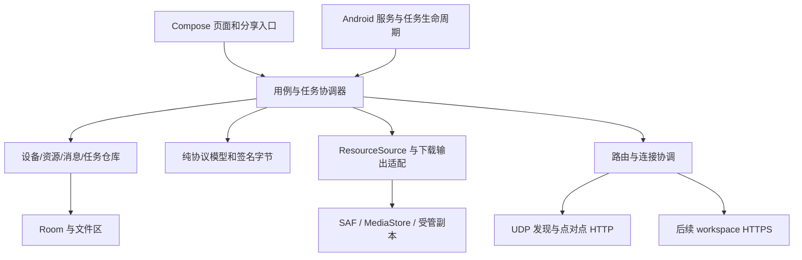

# Android 客户端架构方案 D1

## 1. 结论和证据等级

推荐新增 Kotlin + Jetpack Compose 原生 Android 客户端，每部手机具有独立设备 ID、身份密钥、发布目录和下载队列。通过现有 UDP 发现、HTTP 点对点协议与 Windows 互通，通过现有 HTTPS workspace 协议接入服务器。

这是基于当前代码结构及 Android 平台约束的设计判断，尚未通过样机定案。下文“现状”来自基线代码，“设计”是拟实施行为，“验证门槛”是在继续开发前需要取得的证据。既不以文档通过代替运行验证，也不要求先把所有桌面功能搬到手机。

## 2. 产品范围

### 2.1 首个可交付 APK

| 能力 | 首版行为 |
| --- | --- |
| 设备 | 局域网发现、手动 IP/端口连接、稳定设备身份、昵称、离线记录、增量刷新 |
| 浏览与搜索 | 浏览有权访问的设备资源与目录；按名称、类型、大小筛选已加载目录 |
| 手机文件选择 | 自制分类浏览界面，覆盖媒体、已授权目录、导入文件；支持多选文件、选择文件夹 |
| 发布 | 引用或复制、分组、备注、公开/私有/设备白名单、撤销；权限作用于每次请求 |
| 下载 | 文件/文件夹、持久队列、暂停/继续、进度、文件版本变化处理、保存与导出 |
| 聊天 | 点对点文字、公开资源卡片、私发文件/文件夹；区分排队与接收回执 |
| 提醒 | 消息与定向资源提醒通知；点击进入对应页面，权限拒绝时保留应用内提示 |
| 系统分享 | 接收其他 App 分享的文件；将本地实际文件分享给支持 Android 分享协议的 App |
| 设置 | 昵称、共享开关、存储使用量、缓存清理、通知与网络状态、诊断信息 |

“首版”是完成多个内部里程碑后的 APK，不把仅握手成功的样机称为首版完成。

### 2.2 后续阶段

服务器连接、名单、目录、资源中继、服务器持久副本、上传下载及权限管理接在局域网首版后。公网域名通过 HTTPS 根地址连接，沿用服务器身份固定规则。服务器资源可用不等于对方聊天在线。

服务器聊天邮箱、推送唤醒、iOS、Android MCP 接口、手机 UPnP 自动开放端口、Git 协同、APK 差分更新不纳入首版。它们不是原始四项需求的必要前置能力。若用户要求第一版支持跨公网资源，则把服务器资源阶段合并到首版，保留其他边界。

## 3. 已有代码约束

| 代码位置 | 核对到的现状 | 对 Android 的影响 |
| --- | --- | --- |
| [Core 项目](../../../ResourceManager.Core/ResourceManager.Core.csproj) | net10.0，引用 Microsoft.AspNetCore.App、SQLite，内嵌 Windows xdelta3.exe | 整个 Core 不是可直接认定为 Android 可复用的纯业务库 |
| [PeerNode](../../../ResourceManager.Core/PeerNode.cs) | ASP.NET HTTP 节点、目录、内容、聊天、提醒和私发端点 | 安卓必须能提供入站服务，只有 HTTP 客户端不足以成为对等设备 |
| [LanDiscoveryService](../../../ResourceManager.Core/LanDiscoveryService.cs) | 自定义 IPv4 UDP 广播协议，端口 37643 | Android NSD/mDNS 不能直接替代该发现协议 |
| [PeerAuthentication](../../../ResourceManager.Core/PeerAuthentication.cs) | P-256 签名、首次信任、固定密钥、时间戳、nonce 和请求签名 | 必须精确匹配序列化、签名格式及身份变更处理 |
| [Models](../../../ResourceManager.Core/Models.cs) | 资源、目录、设备能力、消息和权限模型 | 复用协议字段及语义，移动端本地表不必复制桌面表结构 |
| [DownloadManager](../../../ResourceManager.Core/DownloadManager.cs) | 本地路径、临时文件、ETag/Range 续传；元数据可为空 | URI 输出需要单独适配，不能声称所有直连下载已有 SHA-256 校验 |
| [WorkspaceProtocol](../../../ResourceManager.Core/WorkspaceProtocol.cs) | HTTPS 登记、身份校验、Bearer 会话、名单长轮询 | 不是 SignalR；Android 按当前 HTTP 协议实现 |
| [WorkspaceResources](../../../ResourceManager.Core/WorkspaceResources.cs) | 目录、请求签名、describe/tree/meta/chunk 中继，块大小 256 KiB | 没有通用消息总线，不能承载聊天或系统推送而不扩展协议 |
| [WorkspaceStorage](../../../ResourceManager.Core/WorkspaceStorage.cs) | 服务器文件条目、块上传、哈希校验与提交 | 第二阶段可复用协议，不必先重写服务端存储 |
| [私发存储](../../../ResourceManager.Core/NodeStore.PrivateResources.cs) | 私发资源与公开目录分离，绑定收件设备及消息 | 手机也要实现隔离生命周期，不能用公开发布冒充私发 |

## 4. 技术栈选择

### 4.1 备选比较

| 选项 | 能复用的部分 | 主要新增成本 | 本轮判断 |
| --- | --- | --- | --- |
| Kotlin + Compose | 线协议、协议样例、业务规则、设计及互通测试 | Kotlin 业务实现；跨语言签名/JSON；维护两份业务实现 | 推荐。Android 存储、后台任务、分享与通知都能直接围绕平台 API 设计 |
| .NET Android + 原生 Android UI | 分离后的 C# 模型、部分协议/业务逻辑 | Core 拆分；URI、服务、权限适配；替代或验证节点宿主 | 有竞争力的备选；不能因现有 Core 耦合便宣称技术上不可行 |
| .NET MAUI | 上述 C# 复用及潜在跨平台 UI | 同样需要平台适配；WPF 界面不能直接搬入 MAUI | 若近期确定 iOS 或 C# 维护优先，值得重新权衡 |
| Flutter | 线协议和测试样例 | Dart 实现及存储、入站服务、后台任务插件/原生桥接 | 当前没有足够收益支持再增加一条实现路线 |

.NET MAUI 官方支持 Android，不能把“Core 目前不能原样引用”写成“C# 不能做 Android”。见[支持平台](https://learn.microsoft.com/en-us/dotnet/maui/supported-platforms?view=net-maui-10.0)。

不提供未经实测的复用百分比、包体、耗电或开发工期。Kotlin 的优势是平台适配路径明确，代价是协议和业务逻辑双份维护。

### 4.2 推荐方案的具体组成

- UI：Jetpack Compose，ViewModel 暴露单向状态与用户事件。
- 并发：Kotlin Coroutines/Flow，明确应用、共享服务和任务各自的取消作用域。
- 数据：Room/SQLite，事务保存任务、消息和设备状态；设置与密钥句柄单独持久化。
- 身份：Android Keystore 中的 P-256 密钥，协议适配层负责签名格式与编码。
- 出站 HTTP：成熟 Android HTTP 客户端，OkHttp 为候选；具体版本在样机时锁定。
- 入站 HTTP：必须支持请求上限、流式输出、取消、Range、If-Range、HEAD 及明确关停。优先验证维护中的嵌入式服务器实现；具体引擎未选定，不默认 Ktor/Netty 在 Android 上可直接使用。
- 文件：ContentResolver、DocumentsContract/SAF、MediaStore 和应用私有文件区。
- 后台：按用途使用 connectedDevice 前台服务、用户发起的数据传输任务和可中断的后台维护任务；不以一条永驻 WorkManager 任务承载所有网络行为。

建议最低 Android 10 / API 29，以减少早期存储模型分支；这属于产品覆盖建议，需核对实际测试手机。target/compile SDK 在实施时按稳定工具链确认，不能通过降低 target SDK 回避行为限制。依赖许可证、维护状态、Android 运行支持和包体均纳入样机选型记录。

### 4.3 定案门槛

在 Kotlin 方向投入完整 UI 前，先证明：互相验签、实际文件流双向传输、授权目录重启后可用、后台服务可启动并正确停止。若入站服务或跨语言维护出现实质障碍，记录证据并用相同范围的 .NET Android 样机比较。架构评审可以据此推翻推荐，不把前期文档当成锁定技术栈的理由。

## 5. 模块与依赖

建议在同一仓库新增 `ResourceManager.Android/` Gradle 工程。最初只分 Android 应用模块和可独立测试的协议模块，其他边界先以 package/interface 表达，避免在样机前建立大量空模块。

UI 不直接访问 socket、目录扫描或 SQLite。共享服务和页面使用同一个应用级协调器，避免旋转屏幕或重复打开页面启动两套监听。协议模块不依赖 Android Context；平台密钥签名通过接口注入。

核心抽象：

- `ResourceSource`：列举、读取、取得版本信息、判断能否 seek/持久授权；实现分为受管文件与授权 URI。
- `PeerTransport`：握手、目录、文件、消息和提醒，统一处理身份与 HTTP 错误。
- `RouteResolver`：按资源来源和用户连接策略选路，连接失败与权限失败分开处理。
- `TransferCoordinator`：持久任务、取消、续传、校验和导出，维护每个任务唯一执行权。
- `PublicationRepository`：授权范围、资源 ID、分组权限、引用/副本及可用性。

## 6. 身份、协议与网络

每部手机生成新设备 ID 与密钥，不复制 Windows 的身份或会话。昵称只是展示文字。身份密钥损坏、应用卸载或备份恢复后密钥缺失时，生成新身份并要求重新建立设备关联，不偷偷在原 ID 下换密钥。设备 ID/密钥句柄、服务器会话等数据须配置备份排除或一致恢复策略，避免数据库恢复而 Keystore 密钥未恢复。

沿用现有自动首次建立信任的产品规则；已信任密钥改变时阻断连接。首次自动信任不是带外身份认证，不能宣称抵御首次接触时的中间人冒充。

发现复用 UDP 37643；节点 HTTP 优先尝试 37642，冲突时选择可用端口并按协议公告。发现包仅提供候选地址，必须握手校验后更新设备身份。网络切换时取消旧网卡任务、清理活动连接状态，保留设备与离线历史；AP 隔离或广播不可达时支持手动地址入口。

刷新分来源并发、有各自超时和取消，结果逐项展示。慢服务器不能阻塞直连名单。暂时离线、拒绝网络权限或服务暂停都不能自动删除设备；只依据明确身份变化或无可用入口处理失效记录。

路由默认遵循用户已经明确的规则：本地/已配置直连优先；不同局域网且没有配置直连入口时使用绑定服务器。已有直连入口暂时失败，显示原因并允许显式切换服务器，不擅自将“慢/失败”当成用户已授权改用服务器。403、身份变化、无权限不是可降级条件。

当前服务器成员模型没有完整的可直连端点信息。第二阶段不能仅凭成员名单推导 LAN 地址，更不能宣称已有 NAT 穿透；利用已知可信设备 ID 合并本地与服务器目录，未知端点按服务器来源访问。

当前点对点服务是 HTTP + 请求签名，签名不提供文件内容加密。首版兼容此协议，需要 Android 明文网络策略和应用层目的地址约束；动态 LAN IP 很难用静态域名配置精确限定。出站重定向禁止自动带签名跨主机跳转。公网 workspace 继续要求 HTTPS（环回测试例外）。如首版必须保证局域网传输机密性，须增加 TLS/新协议能力并同步修改 Windows，这属于待定范围扩展。[Android 网络安全配置](https://developer.android.com/privacy-and-security/security-config)。

## 7. 文件浏览、发布与存储

### 7.1 自制浏览器的实际边界

首页分类：图片、视频、音频、文档/压缩包、已授权目录、ResourceManager 文件、最近导入。媒体分类来自有权读取的 MediaStore；文档和任意文件目录来自用户授权的 SAF 树。搜索只覆盖这些来源，界面显示当前检索范围，不显示“全盘搜索”这样的错误承诺。

首次添加目录由系统选择器完成授权；之后在自制界面内浏览、按类型过滤和选择。对一次性图片选择可使用 Photo Picker；如要求自制媒体列表，按对应 Android 版本请求所需媒体读取权限并处理仅部分照片授权。默认不申请所有文件访问权限。

Android 11+ 的 SAF 不能授权内部存储根目录、Download 根目录及部分受限制目录；文件移动或删除也可能使已保存授权失效。文档提供者不必支持随机访问、稳定大小或可靠修改时间。[SAF 官方说明](https://developer.android.com/training/data-storage/shared/documents-files)。

### 7.2 发布语义

- 引用：保存持久 URI 授权与资源 ID，实时读取原文件；只在来源具备稳定读取能力时允许。权限撤回时资源标记不可用，保留记录并提供重新授权入口。
- 复制：创建准备任务，将源复制到应用受管文件区，完成后事务提交发布项；准备失败清理本任务的未完成文件。
- 临时分享 URI：不能假定可持久授权。默认在授权有效期间复制；大小未知、空间不足或准备中断时保留明确失败状态。
- 不可 seek、远程云提供者或不能可靠判定版本的来源：提供“复制后发布”，不静默承诺可引用续传。
- 文件夹：发布根资源及树结构。子路径由授权树中的已解析文档映射得到，不把网络传来的任意相对路径直接拼成 Android 文件路径。
- 跨 Windows 文件名：拒绝路径穿越、非法名称、大小写冲突和不兼容条目，给出具体冲突；首版不静默改名导致源和传输目录不一致。遵循现有 `.git` 隔离规则。

目录扫描、复制、文件版本检查均在工作线程执行，支持取消与条目进度。对目录深度、条目数和并发读取设置可诊断的工程上限；具体数值经样机测量确定，超限不能截断后仍报告“完整发布”。

引用文件在传输中改变时，停止并提示重新读取目录。跨多个文件的引用目录不是原子快照；需要稳定版本的场景使用受管副本。稳定 ETag 是 Android 端自己的不透明版本标识，不需要伪造 Windows 时间 ticks。

### 7.3 文件区与持久模型

| 区域/表 | 内容及生命周期 |
| --- | --- |
| 应用私有数据库 | 设备、端点、信任、发布、分组、消息、收藏、任务和 URI 授权引用 |
| `files/managed` | 发布副本和私发副本；用户撤销/清理时按引用关系删除 |
| `files/transfers` | 可恢复的下载片段、ETag 和任务清单；不用可能被系统随时清理的 cache 保存唯一续传数据 |
| `cache/share` | 对外分享的临时包、缩略图；遵循分享有效期后清理，不立即删除接收 App 正在读取的文件 |
| 用户选定目标 | 最终导出文件/目录，通过 SAF 或 MediaStore 写入；卸载应用时已导出文件按平台语义保留 |

关键表至少包含 `Device`、`Endpoint`、`Trust`、`SourceGrant`、`Publication`、`GroupPolicy`、`TransferJob`、`TransferEntry`、`Conversation`、`Message`、`Favorite`。后续新增 `ServerBinding` 与 `ServerSession`。复合主键区分设备 ID、资源 ID、服务器身份和服务器副本模式，不混用服务器绑定 ID 与服务端身份 ID。

私发副本不进入公开目录。任务恢复按持久状态判定，进程退出前的 Running 恢复为可继续状态；数据库事务与文件落盘并非原子操作，要用准备/提交状态和启动恢复扫描消化两者之间的故障。

### 7.4 下载与导出

默认按文件暂存到受管区并校验完成条件，再导出到已选目标。SAF 提供者不保证随机写与原子重命名，所以传输完成与导出完成是两个状态。任务可为 `Downloading → Verifying → Exporting → Completed`，授权过期进入 `NeedsPermission`，空间不足进入 `NeedsSpace`。

文件夹逐文件提交，保留整项任务清单；导出失败可以仅重试导出，不重新下载已完整文件。冲突默认生成明确的新名称或交给用户选择，不覆盖未知文件。删除任务与删除用户已导出文件分开；只自动清理任务自己创建且可证明归属的临时内容。

暂存会增加存储占用，单个大文件导出阶段可能同时占两份空间。UI 在任务前显示已知大小与所需余量；不能满足时报告具体需求。可 seek 的用户目标直写优化放到后续验证，不能为了节省空间牺牲恢复正确性。

## 8. 分享、聊天与通知

入站分享支持 `ACTION_SEND`/`ACTION_SEND_MULTIPLE` 与 URI 读取授权。打开资源确认页，用户选择发布、私发或导入；外部分享本身不自动公开文件。外部文件名、MIME、大小和 URI 均是不可信输入，按有界流读取，拒绝目录越界、异常类型和过大元数据。

出站分享使用系统 Sharesheet 与 `content://` 临时授权。远端资源先下载为实际文件再分享，不把只有局域网内可访问的地址当成外部可下载链接。文件夹提供“打包 ZIP 后分享”，同时显示准备进度与空间占用。能否接收某类型/大小由目标 App 决定，不能保证微信、QQ、飞书的每个版本都支持完全相同的行为。[接收分享](https://developer.android.com/develop/ui/compose/sharing/receive)、[发送分享](https://developer.android.com/develop/ui/compose/sharing/send)。

聊天保持现有消息 ID 去重、持久发送队列、重试和回执语义。`Queued` 不等于送达，接收端回执也不等于用户已读或附件已下载。私发先准备稳定副本，再发送私发资源引用，接收方按权限下载。

通知分为消息、资源提醒、传输、共享服务四类 channel。支持会话静音、消息聚合、点击深链接和未读角标；资源提醒先复核来源/权限，不由通知自动开始写文件。通知权限拒绝时保持应用内未读和状态提示。[Android 通知权限](https://developer.android.com/develop/ui/compose/notifications/notification-permission)。

## 9. 后台与权限

| 状态 | 设计行为 | 明确的边界 |
| --- | --- | --- |
| 前台使用 | 当前网络上发现、监听、收发；按权限展示资源 | 页面切换不重启服务，禁止主线程 I/O |
| 用户开启在线共享 | 尝试以用途匹配的 connectedDevice 前台服务维持对等设备会话，常驻通知可停止共享 | 能否长期用于此场景须经平台和真机验证，不能借类型声明绕过用途限制 |
| 用户启动大传输 | API 34+ 优先评估 UIDT，低版本按传输用途使用前台任务 | UIDT 不是永驻消息监听；系统仍可中断，必须可恢复 |
| 后台未开启共享 | 保存记录；不承诺即时收到点对点请求 | 恢复前台后重新登记/发现 |
| 系统停止或用户强行停止 | 停止在线承诺；对端最终显示离线 | 不自动认定资源被撤销；不保证自启动 |

Android 的 connectedDevice 前台服务有用途与权限前提；dataSync 在目标 Android 15+ 的后台运行有累计时长限制，不能用它冒充无限在线。[服务类型](https://developer.android.com/develop/background-work/services/fgs/service-types)、[Android 15 行为](https://developer.android.com/about/versions/15/behavior-changes-15)。

UIDT 面向用户发起的较长传输，Android 14 起提供；低版本需后备机制。本地 Wi-Fi 传输不能错误地要求网络具有互联网能力，也不能因蜂窝成为默认网络而把局域网 socket 绑错接口。[用户发起的数据传输](https://developer.android.com/develop/background-work/background-tasks/uidt)。

权限按行为申请：基础网络、版本适用的局域网权限、通知、用户选定文件/目录授权、可选媒体读取。Android 17 且 target SDK 37+ 的原始 TCP/UDP 局域网通信需要 `ACCESS_LOCAL_NETWORK`；较低 target 不照搬声明与请求流程。拒绝后显示“无局域网访问权限”，不能伪装成“没有设备”。[局域网权限](https://developer.android.com/privacy-and-security/local-network-permission)。

只在活动发现/共享需要时评估使用 Wi-Fi 多播锁，验证对现有广播协议的实际影响，不全天持锁。CPU 唤醒锁仅覆盖有界的活动传输。屏幕关闭、Doze、厂商省电及 Wi-Fi/蜂窝切换需要真机测量；当前没有耗电结论。

实时后台通知若要求应用不运行也可收到，需要独立设计设备 token、推送提供者、服务端持久消息、回执与去重；现有资源长轮询不能替代这些能力。国内设备不能默认都可使用 FCM，推送提供者选择另立决策。

## 10. 桌面与服务端改动边界

目标是在既有协议下让首版局域网互通，不预先进行 Core 大拆分。第一阶段允许为协议测试增加固定测试向量、测试宿主和必要文档；若发现协议缺陷，另列实际改动及兼容策略。

新能力用可选 capability 协商，不让 Android 冒报路由器发现、UPnP、Git 或 Windows 更新能力。未经实现的端点不能因照搬 Windows capability 列表而被远端调用。

第二阶段复用现有服务器资源操作。若增加独立聊天/推送、平台化更新清单或加密传输，需要新能力标识与协议设计，不能复用旧字段改变语义。Android APK 不能发布成 Windows `SharedUpdatePackage` 候选。

## 11. 开发与交付顺序

| 阶段 | 交付 | 进入下一阶段的条件 |
| --- | --- | --- |
| M0 设计审查 | 本审查包、问题清单与决策修订 | 明确首版范围、后台承诺和技术栈验证条件 |
| M1 互通样机 | Kotlin 协议模块、Android 节点样机、C# 固定向量、隔离测试宿主 | 真机双向握手、发现、目录与 Range 传输成功；确认嵌入式 HTTP 引擎；记录所需桌面修正 |
| M2 存储与传输 | 自制浏览器、SAF/媒体源、发布、分组权限、收藏、下载和恢复 | 授权撤回、空间不足、源变化及进程重启不会静默损坏或误公开数据 |
| M3 首版功能闭环 | 系统分享、聊天、私发、提醒与后台共享、帮助和签名 APK | 原始四条需求逐项有自动化或明确的真机证据；未测项目逐项列出 |
| M4 服务器资源 | HTTPS 加入、名单、目录、中继、持久副本和权限 | 符合直连优先策略；跨网资源传输验证；不误标聊天在线 |

不承诺日期或包体大小，M1 后按工具链、真机可用性、协议缺口和实际工作量给出工期。调试与正式 APK 使用独立签名策略；正式签名密钥不提交仓库，保持后续升级签名一致。先提供签名 APK，是否上架及 AAB 另定。

开发校验使用 CLI、单元测试、隔离节点/服务端以及无窗口模拟器。ADB 日志、安装或 instrumentation 仅针对明确的测试设备；需要改变用户手机状态时先确定测试设备和允许操作范围。全程不采用 computer-use、坐标点击或桌面输入。未有真机时可以推进协议与构建，但不能宣称 M1/M3 真机门槛通过。

## 12. 需要评审的决策

| 编号 | 推荐 | 尚未验证/确认的部分 |
| --- | --- | --- |
| D01 | Kotlin + Compose | 与 .NET Android 的实际复用/维护代价及样机成本 |
| D02 | 首版局域网完整闭环，服务器资源第二阶段 | 用户是否要求首个 APK 即跨公网 |
| D03 | 用户显式开启在线共享，显示持续通知 | 前台服务用途及厂商后台表现；是否需要首版离线推送 |
| D04 | SAF + MediaStore，自制授权范围内的浏览器 | 用户是否接受先授权目录、无法任意读取 App 私有文件 |
| D05 | 引用仅限可稳定读取的来源，否则复制 | 文档提供者能力差异、版本信息可靠性和空间成本 |
| D06 | Android 10+ 为最低覆盖建议 | 实际使用手机及最低版本要求 |
| D07 | 兼容现有签名 HTTP，公网服务器 HTTPS | 是否要求首版局域网加密；若要求需同步演进 Windows 协议 |
| D08 | 同仓库、纯协议模块和跨语言向量 | 避免在移动端建设中引入不必要的桌面大重构 |

这些都是设计建议，不视为用户已同意。评审先解决可能影响路线的 D01、D03、D05、D07；其余可以形成明确默认值后进入开发。
